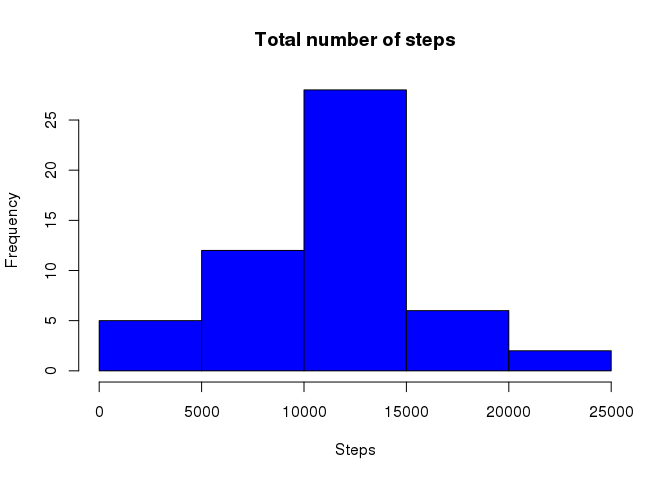
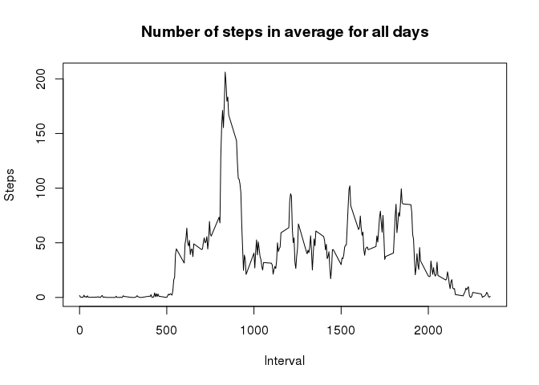
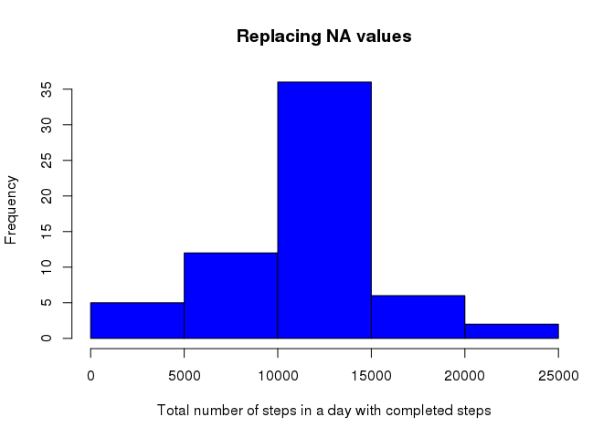
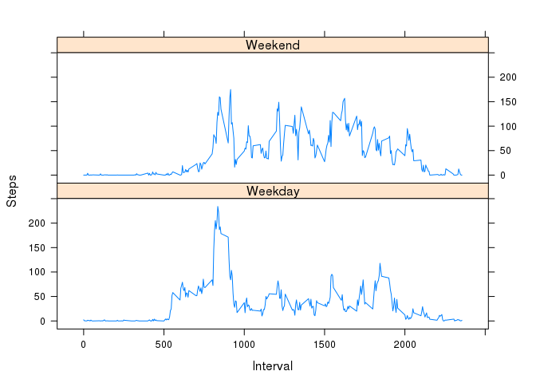

# Reproducible Research: Peer Assessment 1


## Loading and preprocessing the data
The following steps loads and preprocess the data accordingly to the assignment.

1. Load the data (i.e. read.csv())

```r
# first unzip the data file provided with the excercise 
unzip(zipfile = "activity.zip")
# load the data into a dataframe
dataSet <- read.csv("activity.csv")
# creating the variable dateTime that will be used for a later processing
```
2. Process/transform the data (if necessary) into a format suitable for your analysis

```r
dataSet$dateTime <- as.Date(dataSet$date)
# just printing the data structure at the moment
str(dataSet)
```

```
## 'data.frame':	17568 obs. of  4 variables:
##  $ steps   : int  NA NA NA NA NA NA NA NA NA NA ...
##  $ date    : Factor w/ 61 levels "2012-10-01","2012-10-02",..: 1 1 1 1 1 1 1 1 1 1 ...
##  $ interval: int  0 5 10 15 20 25 30 35 40 45 ...
##  $ dateTime: Date, format: "2012-10-01" "2012-10-01" ...
```

## What is mean total number of steps taken per day?
1. Make a histogram of the total number of steps taken each day
The following code plots the histogram graph. 

```r
# we can omit na cases
completeDataSet <- na.omit(dataSet)
# creating a new dataset of the completed cases steps grouped by date and applying the sum function to each group
stepsByDate <- aggregate(completeDataSet$steps, by=list(date = completeDataSet$date), FUN= sum)
# plotting the histogram based on the number of steps 
hist(stepsByDate$x, main="Total number of steps", xlab="Steps", col="blue")
```

 

2. Calculate and report the mean and median total number of steps taken per day.

The mean of steps based on the data of all days:

```r
mean(stepsByDate$x)
```

```
## [1] 10766.19
```
The median of steps based on the data of all days:

```r
median(stepsByDate$x)
```

```
## [1] 10765
```

## What is the average daily activity pattern?
1. Make a time series plot (i.e. type = "l") of the 5-minute interval (x-axis) and the average number of steps taken, averaged across all days (y-axis)

```r
# creating a new dataset of the completed cases steps grouped by date and applying the sum function to each group
stepsByInterval <- aggregate(x = completeDataSet$steps, by=list(interval=completeDataSet$interval), FUN= mean)
# plot the line graph of steps average by interval
plot(stepsByInterval$interval, stepsByInterval$x, type='l',
     main="Number of steps in average for all days", xlab="Interval", ylab="Steps")
```

 

2. Which 5-minute interval, on average across all the days in the dataset, contains the maximum number of steps?

The following code finds the row with the max average value: the 104 row.

```r
# x is the step column, and this line finds the max value
maxValue <- max(stepsByInterval$x)
# finding the row containing the max value
maxValRow <- stepsByInterval[stepsByInterval$x == maxValue, ]
# print the output in the console
maxValRow
```

```
##     interval        x
## 104      835 206.1698
```
## Imputing missing values
1. Calculate and report the total number of missing values in the dataset (i.e. the total number of rows with NAs).

The code calculates the number empty steps rows

```r
# creating the empty values boolean array, it will be used in the next steps
naSteps <- is.na(dataSet$steps)
# output of the number of rows with empty step values
sum(naSteps)
```

```
## [1] 2304
```

2. Devise a strategy for filling in all of the missing values in the dataset. The strategy does not need to be sophisticated. For example, you could use the mean/median for that day, or the mean for that 5-minute interval, etc.

The strategy is to use the stepsByInternal dataset since it's values stores the mean for each 5-minute interval.


```r
# creating a new dataset, preserving the previous one
newDataSet <- dataSet
# converting the interval variable into a factor one
newDataSet$interval <- factor(newDataSet$interval)
# converting the interval variable into a factor one for compatibility purposes
stepsByInterval$interval <- factor(stepsByInterval$interval)
```

3. Create a new dataset that is equal to the original dataset but with the missing data filled in.

```r
# replacing the na values with the interval value
newDataSet[naSteps, "steps"] <- stepsByInterval[newDataSet[naSteps, "interval"], "x"]
# creating a new dataset with the processed data
stepsByDateNA <- aggregate(newDataSet$steps, by=list(date = newDataSet$date), FUN= sum)
```

4. Make a histogram of the total number of steps taken each day and Calculate and report the mean and median total number of steps taken per day.

```r
# plotting the histogram 
hist(stepsByDateNA$x, main="Replacing NA values", xlab="Total number of steps in a day with completed steps", col="blue")
```

 

Do these values differ from the estimates from the first part of the assignment?

The mean of steps for all days including replaced values doesn't differs from the original values.

```r
mean(stepsByDateNA$x)
```

```
## [1] 10766.19
```

What is the impact of imputing missing data on the estimates of the total daily number of steps?

The median of steps for all days including replaced values differs in one point, the new value is around **10766**

```r
median(stepsByDateNA$x)
```

```
## [1] 10766.19
```

## Are there differences in activity patterns between weekdays and weekends?
1. Create a new factor variable in the dataset with two levels -- "weekday" and "weekend" indicating whether a given date is a weekday or weekend day.

```r
# add a new column containing the day of week
dataSet$weekday = weekdays(dataSet$dateTime)
# add a new column to differentiate if a day is a Week day or Weekend day
dataSet$weekdayType <- ifelse(dataSet$weekday == "Saturday" | dataSet$weekday == 
    "Sunday", "Weekend", "Weekday")
# convert weekday to factor
dataSet$weekdayType <- factor(dataSet$weekdayType)
```

2. Make a panel plot containing a time series plot (i.e. type = "l") of the 5-minute interval (x-axis) and the average number of steps taken, averaged across all weekday days or weekend days (y-axis). 

The plot for the time series data, using the lattice library.

```r
# make a new dataset grouping data by interval and weekdayType
stepsByIntervalWeekDay <- aggregate(steps ~ interval+weekdayType, dataSet, mean)
# For a nice plot 'unfactor' interval. I'ts necessary to cast the variable to characters and back to numeric
stepsByIntervalWeekDay$interval <- as.numeric(as.character(stepsByIntervalWeekDay$interval))
library(lattice)
xyplot(steps ~ interval | weekdayType, stepsByIntervalWeekDay, type = "l", 
    layout = c(1, 2), xlab = "Interval", ylab = "Steps")
```

 

